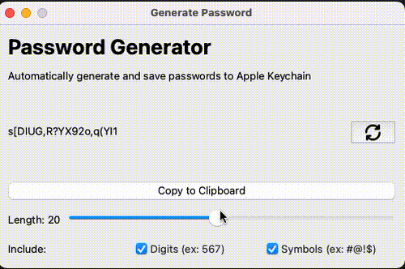
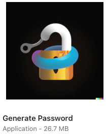

# Password Generator

Generates a GUI that allows users to:

* Enter the web server and username
* Generates a secure password
* Saves the password to the clipboard
* Saves the password to iCloud Keychain
* Generate an App for MacOS for easy findability using Spotlight

## Demo

## Application

## Inspiration

I was inspired by the fact that Apple Keychain occasionally does not recognize a
registration form of a website, which led me to create an app that could then be
easily accessible from spotlight so I could easily generate passwords on the fly
if needed

## Setup

1. (Optional) Create a virtual environment: `python -m venv env`
2. Download the dependencies: `pip install -r requirements.txt`
3. Run the program `python generate.py`

## Compiling an App

One should just need to run `./compile`, but if that does not work, here is
a [link to the documentation](https://pyinstaller.org/en/stable/usage.html) to help with troubleshooting

## Features to Add

- [x] P0: Ability to generate passwords with some configuration
- [x] P0: Ability to save password to keychain
- [x] P0: Add in PyInstaller to create an App
- [ ] P1: Refactor view to multiple components

## Resources

- Used DALL-E 2 to generate icon for the app
- Used [Dashlane's Password Generator](https://www.dashlane.com/personal-password-manager/password-generator) for inspiration for some of the GUI
