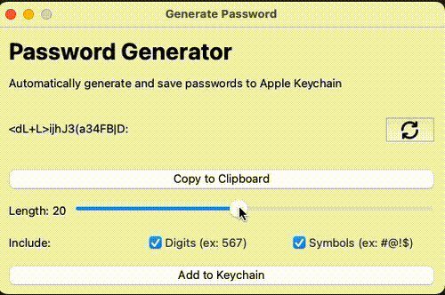

# Password Generator

Generates a GUI that allows users to:

* Enter the web server and username
* Generates a secure password
* Saves the password to the clipboard

## Demo

## Inspiration

I was inspired by the fact that Apple Keychain occasionally does not recognize a
registration form of a website, which led me to create an app that could then be
easily accessible from spotlight so I could easily generate passwords on the fly
if needed

## Setup

1. (Optional) Create a virtual environment: `python -m venv env`
2. Download the dependencies: `pip install -r requirements.txt`
3. Run the program `python generate.py`

## Features to Add

- [x] P0: Ability to generate passwords with some configuration
- [ ] P0: Ability to save password to keychain
- [ ] P0: Add in PyInstaller to create an App
- [ ] P1: Refactor view to multiple components
